# This project has been superseded by [opentx](http://opentx.googlecode.com/) #

The following data is likely obsolete, kept here for mostly just for historical record.

# G9X Features #

We'll add a bunch of screen shots here at first and maybe flesh out some text around them later on.

# Screen Shots #

### Main Screen ###
|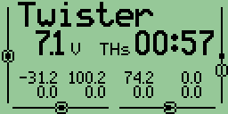 | 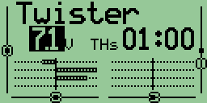 | 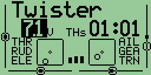 |
|:-------------------------------------------------------------------------------------------------------------------------------------------------------|:--------------------------------------------------------------------------------------------------------------------------------------------------------|:--------------------------------------------------------------------------------------------------------------------------------------------------------|
| 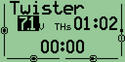 | 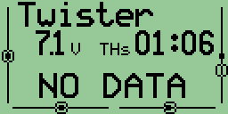 |  |
| The five views of the main screen (the inputs, the output values and bars, the second timer and the telemetry view) | | |

### Model selection ###
|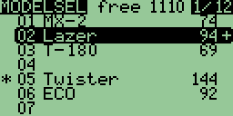 |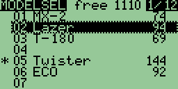 | 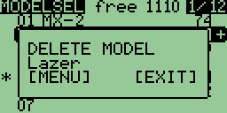 |
|:---------------------------------------------------------------------------------------------------------------------------------------------------|:---------------------------------------------------------------------------------------------------------------------------------------------------|:----------------------------------------------------------------------------------------------------------------------------------------------------|
| The model selection screen where one may select which model s/he will fly and where models can be copied, moved, deleted. | | |

### Flight Phases ###
|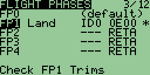 |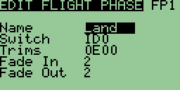 |
|:-----------------------------------------------------------------------------------------------------------------------------------------------------------|:-----------------------------------------------------------------------------------------------------------------------------------------------------------|
| The flight phases screen. Too much to explain here. | |

### DR/Expos Screen ###
|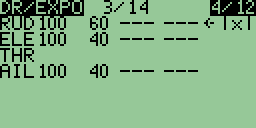 | 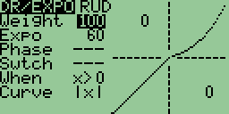 | 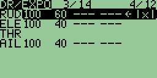 |
|:-----------------------------------------------------------------------------------------------------------------------------------------------|:------------------------------------------------------------------------------------------------------------------------------------------------|:------------------------------------------------------------------------------------------------------------------------------------------------|
| 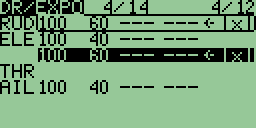 | 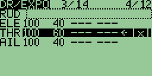 |  |
| The dual rates and expos screens. All lines  can be copied, moved, deleted. | | |

### Calibration ###
|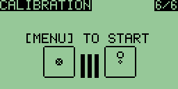 |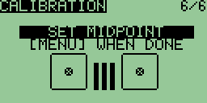 |  |
|:---------------------------------------------------------------------------------------------------------------------------------------------------------|:---------------------------------------------------------------------------------------------------------------------------------------------------------|:----------------------------------------------------------------------------------------------------------------------------------------------------------|
| The calibration of sticks and pots. | | |
