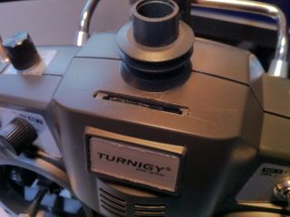
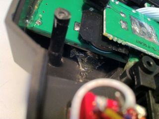
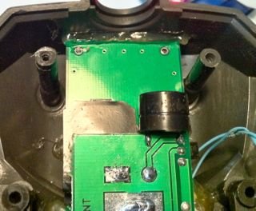
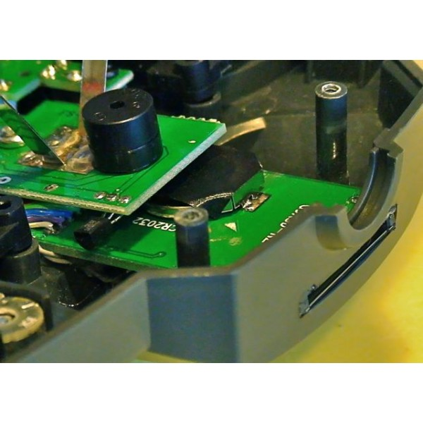
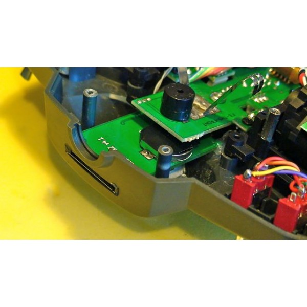
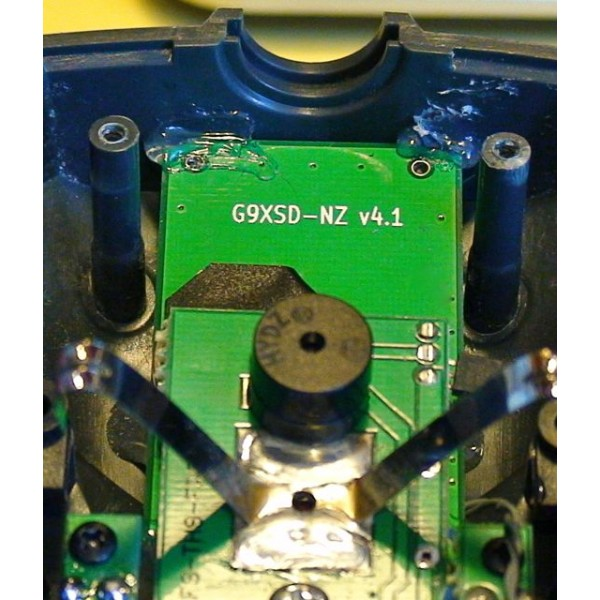

# SD Card / RTC Board Installation #

Here's some pictures showing where Gruvin installed his SD card board -- and where it was designed to fit from the start, if that helps. :-D

|  |
|:------------------------------------------------------------------------------------------------------------------------------------------------------------|
| Almost flush. Could have done better with more care. |

|  |
|:------------------------------------------------------------------------------------------------------------------------------------------------------------|
| Speaker is lowest, then SD card, then original power switch board. |

I put tape over the button battery holder, just in case it
shorts out on something. Probably not required.

|  |
|:------------------------------------------------------------------------------------------------------------------------------------------------------------|
| The original piezo "beeper" is removed and re-soldered as shown, to make room. |

**NOTES**

A recent Turnigy branded '9X was converted and found to have slightly **different piezo beeper circuitry** (a different switching transistor and PCB design around it) which doesn't quite match the photo above. In this case, the piezo was changed by simply 'swapping sides' of the board, such that it end up pointing 'up' (toward the back of the case.)

I probably over-did the hot glue a little. :-D

Oh by the way ... do NOT put a fancy, bulky, plastic connector on the SD card board where the wiring terminates. There isn't room for it. Just solder wires directly and apply some hot-glue to prevent them breaking over time.

An MMC card in an SD-card adapter works just fine. (Gruvin uses a 2GB MMC in this manner.)

The card should be pre-formatted in a computer as "Windows FAT32" -- _not_ NTFS. Most cards are supplied already formatted in FAT32 format. If you have problems, try formatting again yourself. Some people have reported problems with older, slower cards. However, this system should not require anything fancy. Class 2 or higher should be OK -- the higher the better but definitely no need to get the expensive, ultra high speed video recorder versions.

### Some more photos, of a different install ###

These photos show a different installation Gruvin did. Note that the Turnigy power switch board in this one is a later version, with different PCB trace layout around the piezo beeper area. So we simply mount the piezo on the opposite side of the board. **shrug** ...

