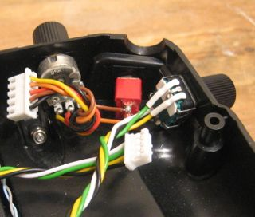
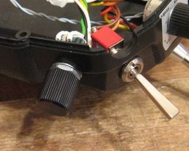
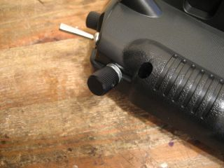
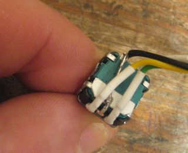
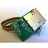
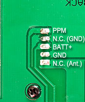
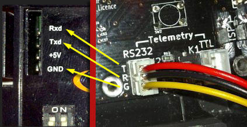
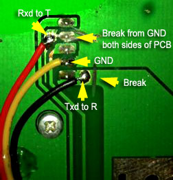

# Custom Board v4.x FAQ #
<b>F</b>requently <b>A</b>sked <b>Q</b>uestions


## G9X v4.x BOARD DISCONTINUED but still fully supported ##

See the [project home page](http://gruvin9x.googlecode.com) for details. More also at the online store [product page](http://gruvin9x.com/shop/gruvin9x/22-gruvin9x-v41-pcb-fully-assembled.html).


---


There is NO PARTICULAR ORDER to this list. **Please read the entire Q and A to get all required information**. If you can't find what you need, either contact Gruvin personally (via Google Code links elsewhere or the [gruvin9x.com](http://gruvin9x.com) contact form) or make a post a question at [9xforums.com](http://9xforums.com). Thanks.


---


**Q**. How do I install my new v4 board?

**A**. General installation is fairly simple. The approximate steps are ...

  1. **Always observe anti-static precautions with electronic parts.**
  1. Remove the six screws from the transmitter casing and split the two halves.
  1. Unplug the wire loom connecting the rear half of the casing to the front
  1. Unplug all of the white (JST) connectors from the stock controller board
  1. **CAREFULLY** unlock the LCD ribbon cable socket by pushing the locking clip (usually black or brown, plastic) away from the board, one end at a time, with a small screwdriver. **BE ESPECIALLY CAREFUL** to operate the tool such that no movement greater than a millimetre (1/16 inch) or so can happen at any time, just in case the clip suddenly gives way. (It is quite easy to break the clip if that occurs.) DO NOT wedge a tool between the main body of the socket and the lock or you'll almost certainly break a clip off the end of the socket.
  1. Remove the nine screws that hold the board into the transmitter casing. Do this with the casing laid out flat on a soft piece of foam or similar, because the LCD screen beneath the board is secured in place only by the main controller board itself -- you do not want it falling out. Place the removed, stock board to one side.
  1. Check that the two front panel buttons to ensure they are properly seated. These are on your left, assuming the bottom of the casing is facing you. The other set of four buttons are held in place by two screws, so nothing should be required there.
  1. Install a previously prepared LED back-light and stick the foam spacer pad to your new v4 controller board, using the white rectangle drawn on the back as a placement guide -- OR -- if you are not installing an LED back-light, you will need to somehow arrange a 6mm thick, SOFT foam spacer pad. IT MUST BE SOFT, to allow easy compression over its entire area. Use the foam on the stock board as a guide. Colour of the foam is not too important, though black is probably best. (It is possible, with a sharp, rounded-end hobby knife, considerable patience and care, to remove the padding from the stock board and transfer it to the new board. At a pinch, several small foam pieces stuck in the corners, center and long-side mid-points will suffice.) You can also (mostly) avoid this entire problem by simply hot-gluing the LCD glass panel into place at its four corners. I do this with the LCD back-light, since it saves a bunch of hassle.
  1. Carefully lower the new board into place, painstakingly moving all the connector plugs out of the way as you go. You will need to do this whilst keeping the board fairly horizontal, in order to have the push-buttons line up with the front panel button inserts. In practice, you can more or less just drop the board rough in place, then move it about side to side to get the buttons to drop into place.
  1. BEFORE PUTTING ANY SCREWS IN ... hold the board firmly in place with one hand and check for proper mechanical operation of all six front panel push-buttons. (You will need to move your grip to over the appropriate buttons as you test each side. Careful -- those pins can draw blood! :P) If one or more buttons do not operate freely, with a definite 'click clack' action, then you might need to check their PCB alignment (home made board) or file down the black button stalks slightly. (All assembled v4 boards from the gruinv9x.com store have already been installed and adjusted in this regard. However, your casing or PCB mounting hole alignment may differ slightly.)
  1. Re-install the nine PCB mounting screws, noting that the four larger screws go in the four extreme corners. DO NOT OVER TIGHTEN. Just snug and a micro-nip more is sufficient.
  1. Double check proper mechanical 'click-click' of all six front panel buttons before continuing. If there's a problem, remove the nine screws and take action to remedy the problem.
  1. Plug in the several white JST connector plugs, leaving the loom from the rear-casing and the LCD ribbon cable, for now.
  1. Open the LCD socket lock and insert the LCD ribbon cable. This could be a little tricky. GENTLE use of a pair of tweezers, acting in small increments on each side of the cable, usually gets the job done. (DO NOT TOUCH the exposed LCD ribbon cable contacts for ANY reason with your fingers!) Once the cable is fully inserted, use either your index finger and thumb on one side and tweezers or _small_ pliers on the other -- or two pairs of tweezers -- to clamp the LCD socket's lock tightly closed. This action requires a delicate balance of force and patience. For newer sockets, you might need to work in smaller increments, one side at a time, so as to reduce total force required and thus avoid breaking something.
  1. If installed, connect the LED back-light 3-pin JST plug to the LED B/L socket in the upper right of the board. BE VERY CAREFUL to ensure that the left hand pin is NOT connected to anything here. Only the center (Gnd) and right (+5 current limited) pins are used.
  1. Hold the rear casing over the front casing, somewhat to the left, off center to give enough working slack on the wire loom, allowing it to be firmly plugged back into the 12 pin JST socket.
  1. Align the two halves of the casing, lock them together and set about re-installing the six case screws, which are all the same size.
  1. Take a moment to admire your fine work -- and how nothing seems different, from the outside. SUCCESS!


---

**Q**. **What CAD software did you use for the board design?**

**A**. [KiCAD](http://en.wikipedia.org/wiki/KiCad) (wikipedia link).


---

**Q**. **Why KiCAD' and not the ever popular Cadsoft Eagle suite?**

**A**. Apart from actually liking KiCAD, this is an open and more importantly FREE for ALL project. KiCAD does everything we need and is free and open source. Eagle on the other hand, demands a hugely expensive (minimum USD$1,145 ATOW) "Pro" license for boards of this size and complexity. So really, it's a no-brainer. Eagle is of no practical use to us what-so-ever.

KiCAD was chosen over another alternative because we (well, gruvin) found that it is easy to download and install on both Linux and Windows (the latter still being the most commonly used platform, for who on Earth knows why, right? :P)


---

**Q**. How do I get a local copy of the PCB design files?

**A**. Install [Subversion](http://subversion.apache.org/), then "check out" (download) the entire pcb-v4.1-frozen directory.

Instructions for doing that (command line version) are on the standard Google "Source" page (see menu, above.) You'll need to change the source path though, as follows.

**For the v4.1(a) files** ...
```
    svn checkout https://gruvin9x.googlecode.com/svn/archive/pcb-v4.1a-frozen g9x-pcb-v4.1
```

That will create a directory named `g9x-pcb-v4.1/`, containing all the files and subdirectories. You can of course use whatever folder name you please. Various bill-of-materials (BOM) files can be found in the `assembly/` sub-folder.

**For the v4.2 files** ...
```
    svn checkout https://gruvin9x.googlecode.com/svn/archive/pcb-v4.2-frozen g9x-pcb-v4.2
```

The RTC/SD-card and prototype receiver multiplexer files are not included in the v4.2 archive, for some unknown reason. Please refer to `/trunk/hardwardware/pcb` in the meantime. The BOM files were also moved to the main PCB directory.


---

**Q**. Where do I find v4.1 board construction tips and advice?

**A**. There's a separate [Build Your Own Board](PcbAssembly.md) wiki page for that, [here](PcbAssembly.md). What follows in this FAQ is more aimed at completed v4.1 boards, being installed into a '9X transmitter housing.


---

**Q**. The JST PH connectors are fiddly to make! Is there an easier way?

**A**. Yes! We found [this eBay store](http://stores.ebay.com/HobbyMart-Shop/2-0-PH-Connector-/_i.html?_fsub=3233409018&_sid=1029096428&_trksid=p4634.c0.m322), which has ready-made JST 2.0mm connectors (2, 3, 4, 5, 6, 7 and 8 pin) with wires attached and at very good prices.

You can probably find the same products in other eBay store languages / locations. Search for "JST Micro 2.0."


---

**Q**. **How do I connect an LED back-light to connector K5?**

**A**. **VERY CAREFULLY** Seriously. The centre pin is GND and the RIGHT-hand pin (labelled '1') is +ve output power for an LED back-light. It includes a 200 ohm series current limiting resistor, which gives a comfortable and practical brightness on the HobbyKing LED back-light module.

If you need a different brightness, you could use your own series current limiting resistor off the left hand pin (3), which is a switched 5V output, utilising its own dedicated regulator as well as a safety fuse. The regulator is rated at _maximum_ 100mA and fused for safety at 250mA (if it gets fried and shorts out, it shouldn't take out the radio. This has not been tested.)

**CAUTION**: There is no series current limiting resistor on the the left-hand, pin-3!


---

**Q**. **How do I use an electro luminescent (EL) back-light?**

**A**. You will need a [SmartieParts](http://www.smartieparts.com/shop/index.php?main_page=product_info&cPath=3&products_id=333) or equivalent EL driver board, to provide the correct type of power for an electro luminescent (EL) back-light.

There are three terminals labelled 'EL B/lite', in the upper left area of the main board. These were originally designed to allow the SmartieParts EL driver board to be mounted directly over them, using individual header pins as dual-purpose stand-off and electrical connections. The board is placed such that the right-hand three driver board pads are soldered to the header stand-off pins, as viewed with the pads at the top of the board. Clear as mud? ... I'll try to draw it ...
```
+-----------+
| o o o o o |
.     1 2 3 .
.           .
.           .
+-----------+
```
Pads labelled 1, 2 & 3 in the above EL board diagram connect via header pins to the v4.1 main board. The left-hand two pads on the driver board go to the EL back-light itself.

The driver board should sit about **5mm above the main board** -- **not** down on the header-pin insulators -- so that it remains well clear of the MENU/EXIT push button leads sticking up from the board.

Header pins are made of high-tensile metal, so the board should be held quite rigidly in place. If you use some other kind of connecting wire instead, then you may need to use something like thick, double-sided adhesive tape to secure and insulate the EL board -- or simply mount it somewhere else entirely.


---


**Q**. **How should I set jumpers J1 (back-light control) and J4 (Vibrator control)?**

**A**. By default, pins 1 & 2 are shorted together on both J1 and J4. For J1, that's the left hand two pads. For J4, it's the upper two pads.

You may want to refer to the circuit schematic to learn what the other positions might be good for.


---


**Q**. **Why doesn't the internal piezo beeper work?**

**A**. Because open9x firmware currently only supports a 'speaker' (usually a cheap headphone element) connected to the 'Spkr' port on the PCB. This is the 2-pin header, labelled 'Spkr' if the upper center-right area of the PC board.

The factory installed piezo beeper (shrieker in some cases! :p) should work just fine, once code exists to turn it on and off. We're hoping to see this added by the open9x team soon. (Time of writing, 2012-09-04.)


---

**Q**. **What type of 'speaker' element should I use?**

**A**. This one can actually be a bit of a problem, as it turns out.

The first few headphone elements used by Gruvin, over several prototype builds, all produced plenty of audio volume. He thus concluded that this would be the most common case. However since then, we have all (including Gruvin) had difficulty finding new elements that make enough noise. We now realise that Gruvin's junk box contained several seemingly uncommon 24ohm headphone elements, whereas those commonly available new are all 32ohm. Doh.

That said, the 'speaker' element used for the prototype was salvaged from one side of a pair of cheap audio headphones. These are the commonly used, roughly 1-inch (25mm) diameter types, with the clear plastic diaphragm and are to be found in most computer or portable music headphones -- the _outside-your-ear_ type, of course. Some (but not all) of the really cheap versions are _far_ too quiet for our purposes. So be prepared from some experimentation. (Ideally, you will find a 24ohm version. (see above). If you do find a stockist for these, please let gruvin know. Thanks! )

There are also two 200-ohm resistors near the 'Spkr' socket on the v4.x boards. These are wired in parallel, to provide 100-ohms total. The idea here was, somewhat ironically as it turns out, to allow simply removal of one resistor to _reduce_ the volume. Hmmm! In practice,  you'll probably want to short the resistors out with a fine wire link over either one of them, to get maximum sound output.

A long term solution for this is still, 'being formulated' (kicked around, aimlessly?) One solution would be to go back to using the factory supplied piezo beeper -- at least for important alarm sounds -- since the piezo is almost always _much_ louder. We're hoping open9x will add a feature for this, perhaps by way of a menu selectable system, similar to the optional haptic (vibrator) device.


---

**Q**. **How are the rotary encoders supposed to be wired?**

**A**. Viewed from the back of the encoder, the wires going to controller board pin numbers 1, 2, 3 and 4 should look something like this ...

```
  3   2
  | | |
     \
  |   |
  4   1
```

... where the upper-middle terminal is connected to the lower right terminal, as shown. (This is the GND or 0V wire.)

The above wiring will make it such that pushing the top of the encoder knob away from you will increase its value -- the same for both left and right encoders. If you prefer to have the encoders operate in the opposite direction, then swap wires 2 & 3. Might I also suggest wiring as follows, ...
```
  2   3
  | | |
   /
  |   |
  1   4
```
... to keep cable flat, with no twists, should you be using ribbon cable. (It doesn't really matter for individual wires as shown in the images below.)

Here are some images of Cam's nice and tidy installation ...

(Please note that wire colours may differ ... so use the diagrams above as the definitive reference.)

|  |  |
|:--------------------------------------------------------------------------------------------------------------------------------------------------------|:--------------------------------------------------------------------------------------------------------------------------------------------------------|
|  |  |


---



**Q**. **How should I install the RTC/SD-card Board?**

**A**. Any way you like, really. But [please see here](SdcardBoard.md) for how Gruvin does it.


---


**Q**. **How to install the gProg board and associated USB socket?**

**A**. The gProg USBasp AVR programmer has its own wiki page, [here](GProg.md).


---


**Q**. **I have a Fr-Sky DHT DIY module. Where are the signals I need?**

**A**. You'll find the most conveniently located GND, BATT+ and PPM connections on the 9X's rear case PCB. Here's an image showing which pin is what ...



Use the 3-pin pseudo-RS232 (left hand one, at the lower right of the G9X board) to connect to GND, Txd and Rxd on the DHT module for telemetry, assuming you have the newer two-way version.

The following images relate to the DJT, external module, but should suffice to add clarity for the DHT as well ...



Gruvin uses an external DJT module, with two wire links added inside, to link pins 2 and 5 of the module socket to _Rxd_ and _Txd_ of the Fr-Sky data port, respectively. Inside the '9X case, on the rear PCB, things look like this ...



**Note that pin 2 has to be broken from the ground plane on this PCB on BOTH sides of the PCB**, as noted in the above image. First, remove the board. On the under-side, where the pins protrude outside the case, temporarily slide the black plastic pin holder bar up the pins (it's quite tight, so ease it a little at a time from each end) then make the break on each side of the pin, then slide the bar back into place and re-fit the board.

**Using TTL** -- others have found the 3.3V TTL lines inside the DJT module and connected to those directly, presumably with something like 1K5 series resistors inline and connect those to the TTL telemetry socket on the G9X main board. I (gruvin) have not tried this, so cannot advise further. Pseudo RS-232 and the method described above, works fine for me.


---


**Q**. **How do I set the v4 board's ATmega2560 MCU option fuses, before the first Flash programming?**

**A**. If you have purchased a ready-made board, the fuses will already be set correctly.

If you have built your own board and assuming you have the cross-compiler environment and project source code installed, along with a `Makefile` set up for your particular AVRDUDE programming device, then you can execute the following command from the `src/` directory ...

> `$ make wfuses`

If you wish to install a pre-compiled .HEX binary firmware version, rather than building from source, you can use AVRDUDE manually to set  MCU fuses, in a similar way to the following ...

> `$ avrdude -c usbasp -P usb -p atmega2560 -U hfuse:w:0x11:m -U lfuse:w:0xd7:m -U efuse:w:0xfc:m`


---

**Q**. **How to fix intermittent power lock-on problem?**

**A**. **This fault was remedied on the v4.2 boards.** For v4.1 board owners, ...

There is a small design flaw in the v4.1 soft-off circuitry that can sometimes cause the radio to lock in the power-on state, after turning off the power switch.

> _This fault can, quite literally, come and go with changes in the weather, moisture levels in the air, local static-electric fields, etc. Thus, not all radios will be affected and some that have been fine for weeks could begin to exhibit the unwanted behaviour later on._

The fix is to solder a 10K resistor across (or on top of) C63, which is located 2 components to the right of the (lower) 3.3V regulator and directly beneath transistor Q9. (Board viewed with LCD screen socket at the "top".)

Note that it is also possible for certain types of system crash to cause this problem. This though is theoretically very unlikely, due to watchdog timer configuration. Never the less, if you have soldered in the new resistor but still have the problem, please let us know.


---
